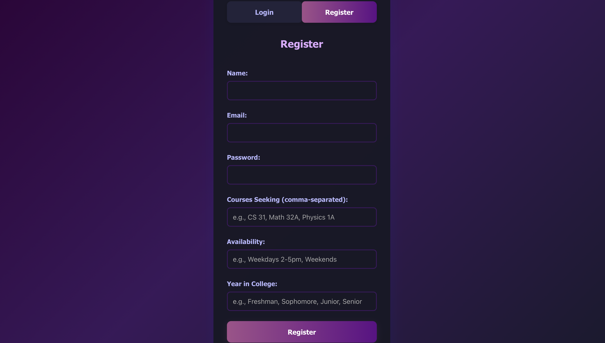
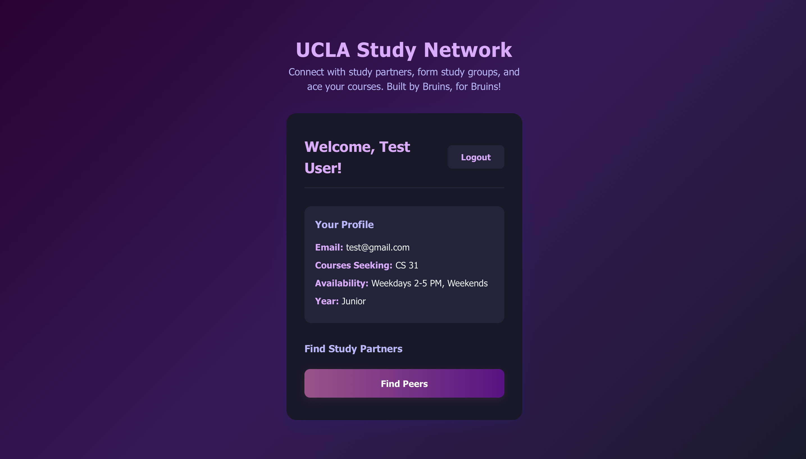
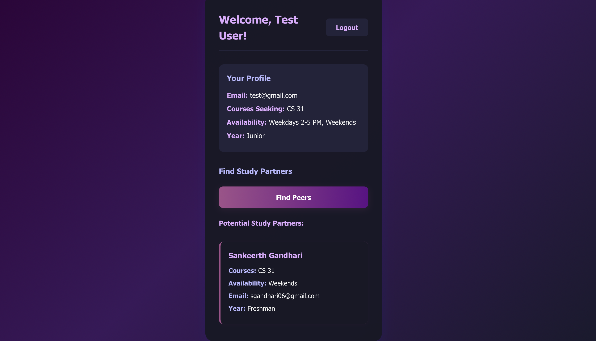

# Peer_Finding_Network_UCLA

 

     

## Overview
Peer-finding for Bruins: match by course, create/join groups, and chat in real time. Clean, modern UI with theme support.

## Quick Start
```bash
# Backend
cd server && npm install && npm run dev

# Frontend (Vite)
cd ../client && npm install && npm run dev
```
- Frontend: http://localhost:5173 (Vite may choose a different port)
- Backend test: http://localhost:5001/api/test

## Configuration
- Frontend base URL: set `VITE_API_URL` (see `client/src/config.js`).
  - Dev (`client/.env.local`): `VITE_API_URL=http://127.0.0.1:5001`
  - Prod (`client/.env.production`): `VITE_API_URL=<your-prod-backend-url>`
- Backend: create `server/.env` with MongoDB URI and `PORT`.
- Theming: dark navy site-wide `#181826`; light mode uses subtle UCLA gold background.

## Features
- Study groups: create, browse, join/leave; automatic system messages.
- Chat: 1-on-1 and group real-time messaging; unread counts; history.
- Peer matching: find study partners by course.
- Profile: edit details, courses, availability; upload avatar (AWS S3).
- UI: responsive, dark/light mode, smooth animations.
- Security: bcrypt hashing (12 rounds), secure auth.

### Recent Improvements
- Dark neon UI: consistent CTA buttons with subtle pulsing glow; improved readability of own chat bubbles (dark blue).
- Accurate member counts: backend now cleans invalid member IDs and returns `memberNames` with each group fetch.
- Group management: creator can kick members, toggle public/private, and members can rename groups.

## API Highlights
- Users: `/api/users/*` (auth, profile, peers)
- Groups: `/api/groups/*` (create, list, join, leave)
- Common endpoints:
  - `POST /api/groups/create`
  - `GET /api/groups/user/:userId`
  - `GET /api/groups/course/:course`
  - `POST /api/groups/:id/join`
  - `POST /api/groups/:id/leave`
  - `POST /api/groups/:id/kick` (creator)
  - `POST /api/groups/:id/toggle-visibility` (creator)
  - `POST /api/groups/:id/rename` (member)
  - `GET  /api/groups/:id` (returns `group` with `memberNames`)

## Tech Stack
- Frontend: React (Vite)
- Backend: Node.js, Express
- Database: MongoDB (Mongoose)
- Realtime/Chat: Firebase (optional)


## Screenshots (MVP version)
Login page


Register page


Dashboard


Peer finder


## License
[MIT](LICENSE)