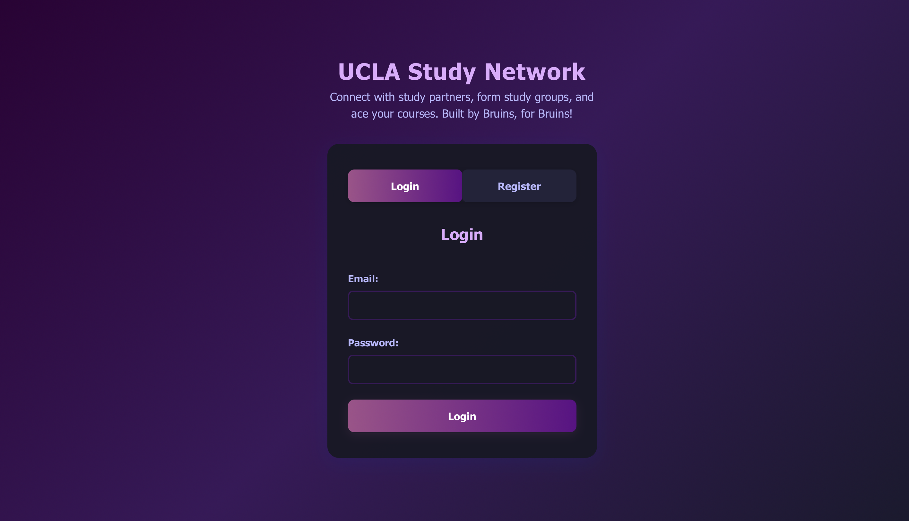

# Peer_Finding_Network_UCLA

 

---

     

## Project Overview
The UCLA Peer-Finding Network is a full-stack web app that helps Bruins find study partners, form groups, and ace their courses. It features real-time chat, peer matching, profile management, and a modern, responsive UI with dark/light mode. The landing page is professionally designed with UCLA branding and highlights upcoming features.

---

## Screenshots
Login page MVP  


Register page MVP  


User dashboard  


Peer finding  


---

## Features
- **Professional Landing Page** with UCLA branding and clear feature highlights
- **"Coming Soon" Badges** for future features (UCLA student verification, mobile app & notifications, personalized study groups)
- **User Registration & Login**
- **Edit Profile** (courses, availability, year)
- **Find Study Partners** (peer matching by course)
- **Real-Time Chat** (1-on-1 messaging, instant updates)
- **Unread Message Notifications** (red dot on messages icon)
- **Dark/Light Mode** toggle
- **Responsive Design** for all devices

---

## How It Works
### Real-Time Chat
- When you open a chat, a real-time Firestore listener is set up for that conversation.
- Any new messages sent by either user appear instantly in both users' chat windows—no refresh needed.
- Messages are stored in Firestore under a `conversations` collection, with a `messages` subcollection for each conversation.

### Unread Message Notifications
- If you have unread messages, a red dot appears on the messages icon in the top right.
- The unread count is updated on login, refresh, or after closing the chat/messages modal.
- When you open a chat, all messages in that conversation are marked as read and the red dot disappears if there are no other unread messages.

---

## Getting Started

### 1. Clone the repo
```bash
git clone <your-repo-url>
cd Peer_Finding_Network_UCLA
```

### 2. Set up the backend
```bash
cd server
npm install
# Create a .env file with your MongoDB URI and PORT
npm run dev
```

### 3. Set up the frontend
```bash
cd ../client
npm install
npm run dev
```

### 4. Open your browser
- Frontend: [http://localhost:5173](http://localhost:5173)
- Backend test route: [http://localhost:5001/api/test](http://localhost:5001/api/test)

---

## Configuration
- By default, the frontend expects the backend at `http://127.0.0.1:5001`.
- To change this, create a `.env` file in `client/` and set:
  ```
  VITE_API_URL=http://localhost:5001
  ```

---

## Backend Setup - Server
- The backend must be running for the app to work.
- Make sure MongoDB is running and the backend is started (usually on port 5001).

---

## Usage Tips
- **Landing Page**: Click "Get Started" to proceed to login or registration.
- **Edit Profile**: After updating your profile, the peer list will clear. Click "Find Peers" again to see updated matches.
- **No Matches**: If no one is registered for your courses, you'll see a message instead of an empty list.
- **Logout**: Click the "Logout" button in the dashboard header to sign out.

---

## License

[MIT](LICENSE)