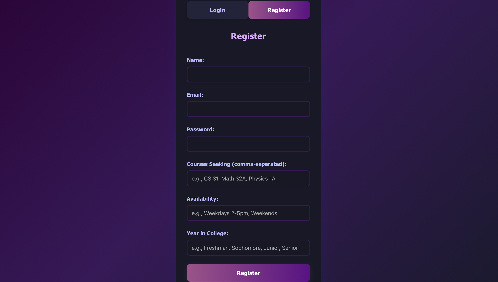
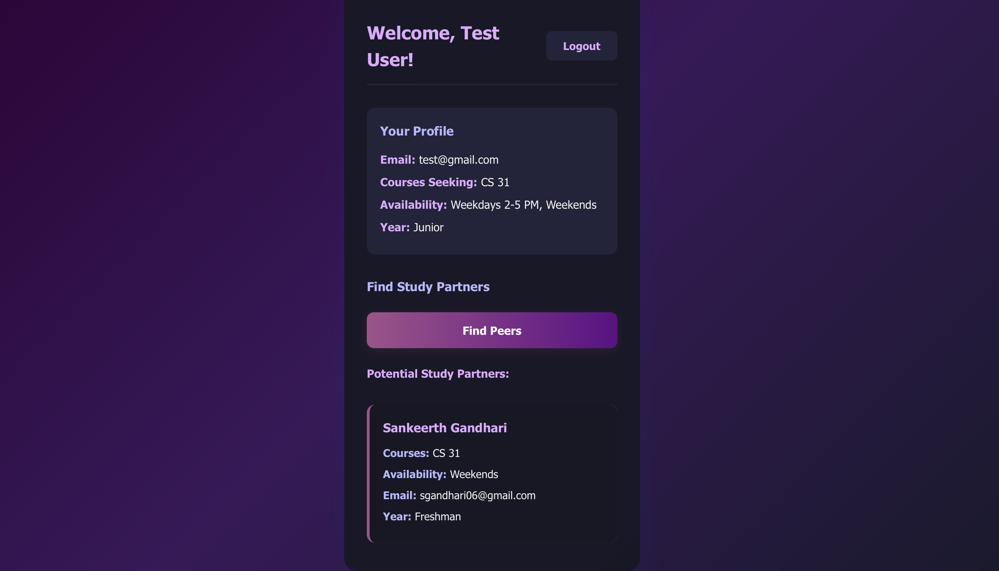

# UCLA Study Network - Client

This is the frontend for the UCLA Study Network, a web app to help Bruins find study partners, form groups, and ace their courses.

## Features
- **Landing Page**: When you first visit the app, you'll see a welcoming landing page with information about the platform and a "Get Started" button.
- **User Registration & Login**: After the landing page, you can sign up with your name, email, password, courses, availability, and year, or log in if you already have an account.
- **Edit Profile**: After logging in, click "Edit Profile" to update your courses, availability, or year. Your changes will update your profile and affect your peer matches.
- **Find Study Partners**: Click "Find Peers" to see a list of other students seeking the same courses. If no matches are found, a friendly message will appear.
- **Dark/Light Mode**: Toggle between beautiful dark and light themes.

## How to Run (Development)

### Prerequisites
- Node.js and npm installed
- Backend server running (see below)

### 1. Install dependencies
```sh
npm install
```

### 2. Set API URL (optional)
By default, the frontend expects the backend at `http://127.0.0.1:5001`. To change this, create a `.env` file and set:
```
VITE_API_URL=http://localhost:5001
```

### 3. Start the frontend
```sh
npm run dev
```
Visit [http://localhost:5173](http://localhost:5173) in your browser.

---

## Backend Setup - Server
- The backend must be running for the app to work.
- See `../server/README.md` for backend setup instructions.
- Make sure MongoDB is running and the backend is started (usually on port 5001).

---

## Usage Tips
- **Landing Page**: Click "Get Started" to proceed to login or registration.
- **Edit Profile**: After updating your profile, the peer list will clear. Click "Find Peers" again to see updated matches.
- **No Matches**: If no one is registered for your courses, you'll see a message instead of an empty list.
- **Logout**: Click the "Logout" button in the dashboard header to sign out.

---

## Screenshots

**Dashboard**


**Login**


**Register**



**Peer List**



---

## License
MIT
